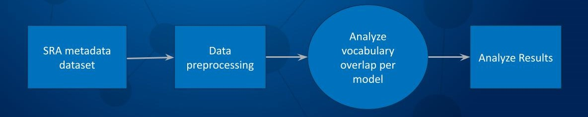

# Team Project Name

List of participants and affiliations:
- Participant, Affiliation (Team Leader)
- Participant, Affiliation

## Project Summary
The NCBI Sequence Read Archive (SRA) contains valuable research data, but its metadata is often unstandardized, leading to misspellings and variations in how data is described. This project aims to use machine learning and AI to standardize these metadata fields.

## Problem Statenent
The metadata fields in SRA accessions are manually entered and lack standardization, leading to issues such as misspellings and variations in terminology. This inconsistency makes it challenging to effectively search and analyze the data.

Open Questions:
  - What machine learning models would be most effective in standardizing the unstandardized metadata fields?
  - Would using a model trained on biomedical research data accelerate our progress toward standardization?
  - How much overlap is there in the vocabulary of different models?
  - Can we leverage an NLM (National Library of Medicine) model to classify the unstandardized metadata into categories?

## Desired Outcomes and Approach
Our goal is to explore whether using a machine learning model trained on biomedical research data can help standardize the unstandardized fields in SRA metadata. We also want to determine the level of overlap in vocabulary between these models. To achieve this, we will preprocess the data, potentially using tokenization, and analyze the vocabulary overlap

SRA Metadata dataset -> Data Preprocessing -> Analyze Vocabulary Overlap per Model -> Analyze Results 

## Future Work

## NCBI Codeathon Disclaimer
This software was created as part of an NCBI codeathon, a hackathon-style event focused on rapid innovation. While we encourage you to explore and adapt this code, please be aware that NCBI does not provide ongoing support for it.

For general questions about NCBI software and tools, please visit: [NCBI Contact Page](https://www.ncbi.nlm.nih.gov/home/about/contact/)

